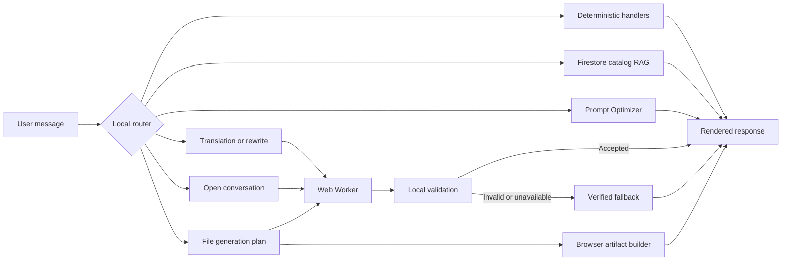

# Local AI Model

## Model

| Model | Model ID | Execution | Quantization | Approximate download |
| --- | --- | --- | --- | --- |
| SmolLM2 135M | `HuggingFaceTB/SmolLM2-135M-Instruct` | WebGPU or WASM | `q4f16` on WebGPU, `q4` on WASM | 118 MB |

Koda uses Transformers.js 4.2.0 and the text-generation pipeline in a dedicated Web Worker. SmolLM2 is the only selectable runtime internally; the application does not expose a model picker.

Model card:

- <https://huggingface.co/HuggingFaceTB/SmolLM2-135M-Instruct>

Review each model card and linked license before redistribution. This document is a technical summary, not legal advice. Koda does not send prompts to a hosted model endpoint.

## Runtime Flow



`local-ai.js` creates a verified draft before model inference. Model output replaces that draft only when mode-specific validation succeeds.

## Response Hardening

Common, bounded requests bypass SmolLM2. Deterministic handlers cover greetings and conversation controls, safety and high-stakes boundaries, live-data limitations, arithmetic and percentages, local date/time, text counts, common unit conversions, selected stable definitions and comparisons, extractive summaries, outlines, checklists, agendas, plans, email and social templates, and common Italian/English translations.

Open-ended conversation has a separate system prompt requiring a direct first sentence, stable knowledge, concise structure, explicit uncertainty, and no invented live data, sources, URLs, or actions. Validation checks topic overlap, language, informative content, prompt leakage, repeated segments, degenerate token repetition, and unapproved URLs.

Arbitrary translation and rewriting use a transformation-only prompt. Accepted output must preserve source numbers, URLs, email addresses, placeholders, acronyms, and proper-name tokens. Translation also enforces the target language and rejects unchanged or excessively expanded text.

## Retrieval and Grounding

### Catalog RAG

Catalog entries come from Firestore and are ranked locally. Name matches, category and description terms, aliases, alternatives, requested pricing, structured specializations, and declared capabilities contribute to the score. Controlled family aliases resolve common shorthand such as `GPT` to `ChatGPT` and `Gemini` to `Google Gemini`; full catalog names take precedence on overlaps, so `Zero GPT` remains distinct. The router detects both the requested area (`excel`, `word`, `pptx`, `pdf`, `images`, `video`, `audio`, `code`, `data`, or `automation`) and the requested operation (`create`, `read`, or `edit`).

When structured candidates exist, only tools with a compatible declared capability are recommended. If the specialization exists but the operation is not confirmed for any tool, the deterministic response states that no compatible capability is recorded. Legacy records without structured metadata retain the previous text-based ranking fallback when no structured candidate is available.

Tool comparisons are deterministic and use only Firestore fields. They include logos in the UI, descriptions, categories, pricing, websites, specialization badges, and a create/read/edit matrix. Missing values are labeled as not specified; the recommendation distinguishes declared coverage from output quality. At most five verified records are placed in a model prompt. Unknown tool names and unverified bullet entries are rejected.

### Prompt Optimizer

Prompt Optimizer is an inline mode in the existing conversation. Toggling it does not clear messages or open a separate chat. With SmolLM2 it uses the deterministic seven-section rewrite directly, avoiding a slower model attempt that is unlikely to pass validation.

### File Generation

Explicit file requests use a separate prompt and validation rules. HTML must be a complete document without active or remote content, JSON must parse to an object or array, and tabular formats require a header, a data row, and a consistent column count. File requests use a 320-token target, transformations use 180 tokens, and all request values are clamped to 384 tokens. Regular chat uses 120 tokens. Prompt Optimizer is deterministic.

When generation is rejected or unavailable, spreadsheet drafts infer columns for common business cases. Reports, memos, and letters use structured placeholders. These drafts are designed to remain useful without claiming that missing data exists.

Generated content is converted locally into browser Blobs. The model does not create binary files directly.

The compact PDF writer uses a built-in Helvetica font and transliterates accented and other non-ASCII characters to ASCII. XLSX output preserves UTF-8 text in OOXML inline strings.

## Loading, Caching, and Timeouts

- No model download starts automatically when the application opens.
- The first request that needs generation downloads SmolLM2 lazily. There is no model selector or download panel.
- Transformers.js downloads model assets from Hugging Face and its runtime from jsDelivr.
- Transformers.js uses a custom OPFS cache that streams weights to local browser storage. Existing Cache API entries remain readable as a compatibility fallback. The service worker caches application modules, not model weights.
- The SmolLM2 cache uses a dedicated directory. On first migration it removes the retired Gemma OPFS directory, related Cache API entries, and the old dual-model marker.
- WebGPU is preferred. SmolLM2 falls back to single-threaded WASM when WebGPU is unavailable.
- Normal model requests use a 120-second inactivity timeout. File generation and WASM requests use 240 seconds.
- The worker aggregates downloaded bytes across concurrent files and emits monotonic progress at a limited rate.

If WebGPU is unavailable or the worker fails, Koda switches to the verified deterministic result. A failed worker is not repeatedly recreated during the same page session.

## Regression Tests

Run the local suite from the application directory:

```powershell
node --test tests/local-ai.test.mjs
```

The suite uses a simulated Worker and controlled outputs, so it tests model acceptance and rejection without loading model weights. Intent and strategy metadata distinguish deterministic, accepted-model, and verified-fallback paths.

## Limitations

SmolLM2 135M is optimized for size and speed. It primarily understands English and has limited factual recall, reasoning, context handling, and Italian quality. Raw output may be irrelevant, repetitive, incomplete, or switch language.

Koda mitigates these limits with short prompts, reduced history, deterministic drafts, verified catalog records, language and topic validation, repetition checks, and mode-specific fallbacks. Invalid model output is discarded. These controls reduce risk but do not make generated content authoritative. Users should verify important factual, financial, medical, legal, or security-related output.