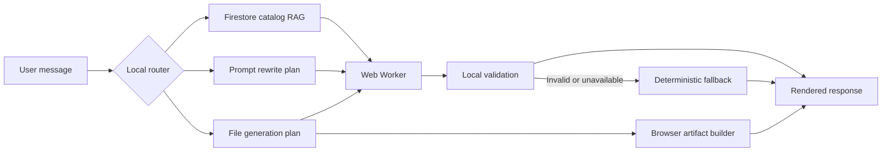

# Local AI Model

## Model Identity

| Property | Value |
| --- | --- |
| Model | `HuggingFaceTB/SmolLM2-135M-Instruct` |
| Publisher | Hugging Face TB |
| Parameters | 135 million |
| Architecture | Decoder-only Transformer |
| Primary language | English |
| Runtime | Transformers.js 3.7.2 |
| Execution | WebGPU in a dedicated Web Worker |
| Quantization used by Koda | `q4f16` |
| Approximate first download | 118 MB |
| License | Apache License 2.0 |

The model is available without an inference API charge and can be used, modified, and redistributed under the Apache 2.0 license conditions. This statement is a technical summary, not legal advice. The Koda application does not send prompts to a hosted model endpoint.

Model card: <https://huggingface.co/HuggingFaceTB/SmolLM2-135M-Instruct>

License: <https://www.apache.org/licenses/LICENSE-2.0>

## Runtime Flow

`local-ai.js` creates a verified draft before model inference. Model output replaces that draft only when mode-specific validation succeeds.

## Retrieval and Grounding

### Catalog RAG

Catalog entries come from Firestore and are ranked locally. Name matches, category and description terms, aliases, alternatives, and requested pricing contribute to the score. At most five verified records are placed in the model prompt. Unknown tool names and unverified bullet entries are rejected.

### Prompt Optimizer

Prompt Optimizer uses a separate session mode and system prompt. It is instructed to rewrite the supplied prompt without answering it. A deterministic rewrite remains available when WebGPU is missing, generation times out, or validation fails.

### File Generation

Explicit file requests use a separate prompt and validation rules. HTML must be a complete document, JSON must parse, and tabular formats must contain at least a header and data row. The worker receives a 480-token target for file content; all request values are clamped to a maximum of 640 tokens. Regular chat remains at 160 tokens.

Generated content is converted locally into browser Blobs. The model does not create binary files directly.

The compact PDF writer uses a built-in Helvetica font and transliterates accented and other non-ASCII characters to ASCII. XLSX output preserves UTF-8 text in OOXML inline strings.

## Loading, Caching, and Timeouts

- The model is loaded lazily on the first request that needs generation.
- Transformers.js downloads model assets from Hugging Face and its runtime from jsDelivr.
- Browser caching is enabled through Transformers.js. The service worker caches the application modules, not the full model repository as part of the install shell.
- Normal model requests use a 30-second inactivity timeout.
- File generation uses a 60-second inactivity timeout because it requests more output.
- Download progress messages refresh the active timeout and update the chat status indicator.

If WebGPU is unavailable or the worker fails, Koda switches to the verified deterministic result. A failed worker is not repeatedly recreated during the same page session.

## Limitations

The model publisher states that SmolLM2 primarily understands and generates English. The 135M variant has limited factual recall, reasoning capacity, context handling, and multilingual quality. Output may be inaccurate, inconsistent, biased, or incomplete.

Koda mitigates these limits with narrow prompts, deterministic drafts, verified catalog records, output validation, and mode-specific fallbacks. These controls reduce risk but do not make generated content authoritative. Users should verify important factual, financial, medical, legal, or security-related output.